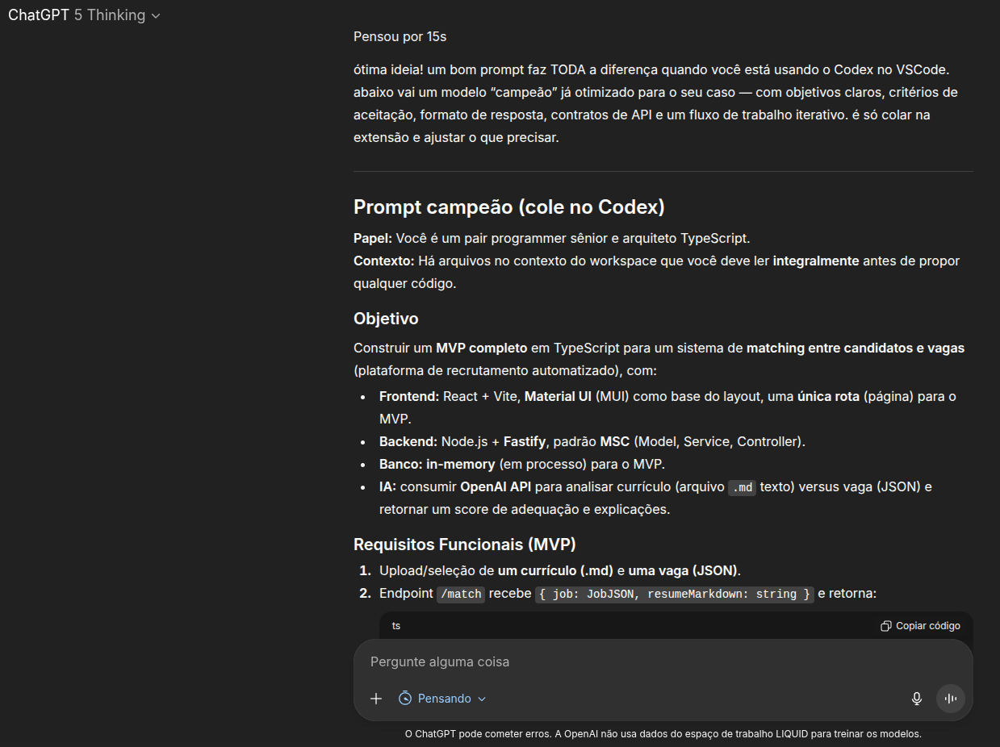
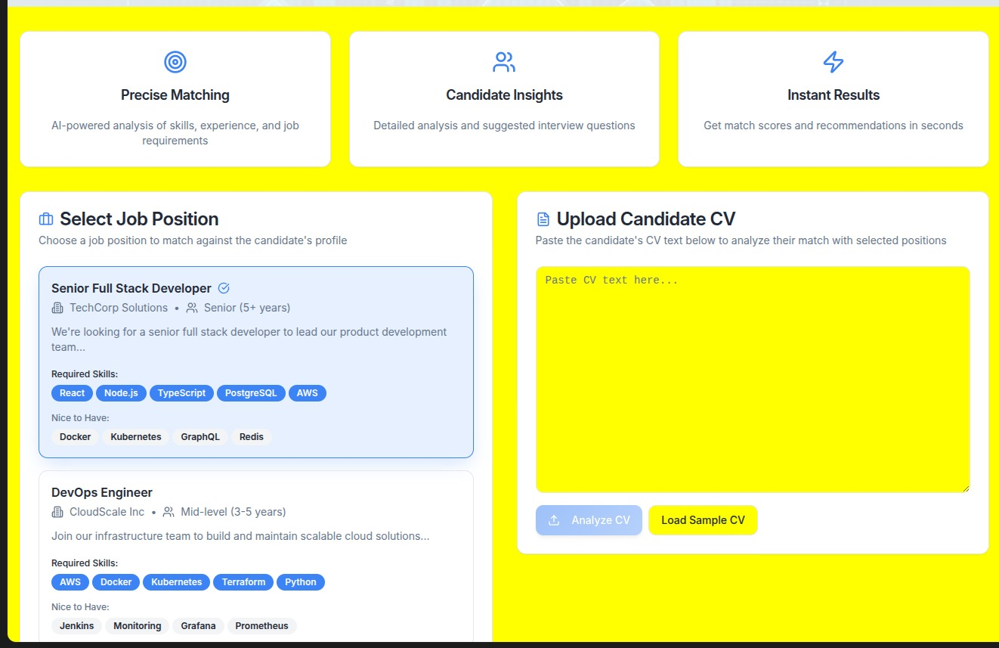
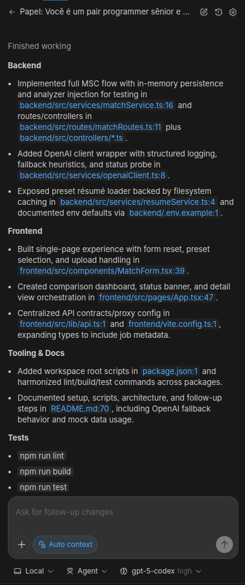

## Visão Geral da Implementação

O projeto entrega um MVP full-stack totalmente em TypeScript dividido em dois pacotes (`backend/` e `frontend/`) coordenados via workspaces do npm.

- **Backend (Fastify + MSC)**: expõe `POST /api/match`, `GET /api/match` e `GET /api/match/report/:id` (além de outras rotas/métodos utilitários), persiste resultados apenas em memória e mantém um fallback heurístico quando a chave da OpenAI não está disponível. A camada de service encapsula a chamada à IA e registra métricas básicas (modelo, tokens, duração).
- **Frontend (React + Vite + MUI)**: página única com descrição da vaga e currículo (upload/colagem ou seleção de presets), dashboard individual com cards de insights e modo comparativo em tabela para vários candidatos.
- **Testes**: casos unitários em `backend/test/matchService.test.mjs` cobrem a service de matching, verificando fallback heurístico, ordenação e injeção de analisadores.


## Requisitos de Ambiente

- Node.js ≥ 20
- npm ≥ 10


## Scripts Principais

| Comando                     | Descrição |
|-----------------------------|-----------|
| `npm run dev:backend`       | Inicia o Fastify em modo watch (porta 3333) |
| `npm run dev:frontend`      | Inicia o Vite dev server com proxy para `/api` |
| `npm run build`             | Compila o backend (tsc) e gera o bundle do frontend |
| `npm run lint`              | Lint em ambos os pacotes |
| `npm run test`              | Executa os testes unitários do backend |


## Como executar o projeto localmente

Clone o repositório do GitHub, instale as dependências e copie o arquivo `.env.example` para a raiz do backend, rodando o comando abaixo a partir da raiz do projeto:

```bash
npm run configure
```

> Configure, no arquivo `.env`, a variável `OPENAI_API_KEY` com uma chave válida da OpenAI para habilitar a análise usando o modelo informado em `OPENAI_MATCH_MODEL`. Quando ausente, o serviço passa automaticamente para o modo heurístico.

Para iniciar o servidor backend na porta 3333, execute o seguinte comando em um terminal na pasta raiz do projeto:

```bash
npm run dev:backend
```

Para iniciar o servidor frontend na porta 5173, execute o seguinte comando (em um terminal diferente do anterior) na pasta raiz do projeto:

```bash
npm run dev:frontend
```

> Agora, será possível acessar a aplicação através da URL `http://localhost:5173/` ou apenas `localhost:5173` em seu navegador de preferência.
> Caso a aplicação não abra corretamente ou o backend não encontre as chaves de ambiente necessárias (descritas dentro do arquivo `.env`), pode ser necessário exportar as variáveis de ambiente com o comando abaixo:

```bash
export $(cat ./backend/.env | xargs)
```


## Estrutura de Pastas (arquivos principais)

```
backend/
  src/
    controllers/
    models/
    routes/
    services/
    server.ts
  test/matchService.test.mjs
  package.json
frontend/
  src/
    components/
    lib/
    pages/
    main.tsx
  package.json
mocks/
  cvs/
  jobs/
README.md
```


## Fluxo do Backend

1. Controller valida o payload com Zod, e delega a regra de negócio e outras validações para a service.
2. Service normaliza o JSON da vaga, roda `analyzeMatch` e persiste o resultado em memória através do uso de Map.
3. `analyzeMatch` usa OpenAI quando configurado; caso contrário aplica heurística baseada em keywords da vaga.
4. Logs registram origem (`openai` ou `fallback`) e duração.
5. Endpoints auxiliares: `/api/match` (lista resumos), `/api/presets/resumes` (currículos mockados), `/api/presets/job` (vaga mockada), `/api/status` (exibe se OpenAI está ativo).


## Experiência do Frontend

- Upload de arquivos `.md` (currículo) ou seleção de presets carregados.
- Snackbar de feedback para sucesso/erro, mensagens de fallback quando a análise heurística está ativa.
- Visualização individual com cards de score, qualidades, lacunas e perguntas sugeridas; modo comparativo mostra todos os matches em uma tabela com destaque para o melhor score.
- Layout responsivo utilizando MUI, com acessibilidade básica (`aria-label` em textareas, botões com `aria-label`).


## Testes

```bash
npm run test
```

Os testes trocam o analisador da service (`setMatchAnalyzer`) para simular respostas e garante ordenação/armazenamento em memória.


## Próximos passos sugeridos

1. Persistência em banco (PostgreSQL) com repositórios dedicados.
2. Autenticação e segregação por empresa/recrutador.
3. Cache para reutilizar resultados de matches repetidos.
4. Evoluir ferramentas de leitura para permitir imagens e/ou PDFs (extração de conteúdo textual para a leitura).
5. Aprimoramentos e refinamentos no prompt/treinamento da IA para uma validação mais precisa (principalmente em relação ao Score).


## Decisões Técnicas e trade-offs

### Frontend

- **Stack:** React + Vite
- **Por quê:** Inicialização rápida do projeto, *Developer Experience* simples e familiaridade prévia.
- **Trade-offs:** Vite facilita a configuração inicial e HMR, mas exige alguns ajustes de build para cenários mais complexos (ex.: SSR ou integrações específicas - não é o caso desse MVP).


### Estilização

- **Biblioteca:** Material UI (MUI)
- **Por quê:** Legibilidade alta e amplo catálogo de componentes prontos, acelerando o MVP sem CSS extensivo.
- **Trade-offs:** MUI entrega produtividade imediata; Tailwind daria controle granular, porém com maior custo inicial de design system.


### Backend

- **Stack:** Node.js + Fastify
- **Por quê:** Alinhamento com a stack utilizada pela Recrut.AI e objetivo de reciclar experiência com Node no backend. O Fastify foi escolhido em relação ao Express pelas validações nativas, performance e uma estrutura de rotas/handlers mais amigável.
- **Trade-offs:** Sem necessidade de middlewares específicos, o Express não traria vantagens claras neste MVP.


### IA para Análise de Currículos

- **Serviço:** OpenAI API
- **Por quê:** Integração simples em Node/Python, modelo robusto para análise textual e geração de saídas padronizadas.
- **Trade-offs:** Dependência externa (custo/latência) — mitigado com fallback heurístico e contrato de resposta consistente.


### Ferramentas de Apoio
- **Lovable:** Referência de estrutura de componentes, apresentação em tela e modelagem de dados amigável ao usuário.
- **Codex (VSCode):** Geração da maior parte do código e lógica do MVP, otimizando tempo de desenvolvimento.


### Contribuições Manuais

- Regras de **ESLint** e **Prettier** ajustadas para padronização do código.
- Testes e correções visuais pontuais.
- **Documentação**: melhorias no README do desafio e docstrings em funções, métodos e componentes.


## IA DevTools

### Visão geral
O MVP foi construído adotando um **fluxo guiado por IA**, combinando geração de código, revisão de prompts e referências de UI. As ferramentas atuam de forma complementar:

- **Codex (VSCode | Agente `gpt-5-codex high`):** Responsável pela geração da maior parte do código e estrutura inicial. Utilizado como pair programmer para criar módulos MSC no backend e componentes no frontend.
- **GPT:** Focado em engenharia de prompt, revisão de decisões e refino de textos (README, mensagens de erro, copy da interface). Também ajudou em correções pontuais e esclarecimento de dúvidas técnicas durante o desenvolvimento.
- **GitHub Copilot:** Utilizado sobretudo para autocomplete e documentação inline (docstrings, JSDoc/TS), acelerando a escrita de trechos repetitivos e pequenas otimizações.
- **Lovable:** Serviu como guia de UI/UX: disposição de elementos, hierarquia visual e quais dados exibir. A partir dessas referências, os componentes foram implementados em React + MUI.


### Fluxo de trabalho adotado

1. **Prompt → Codex:** escrever prompts curtos e objetivos para gerar estruturas, rotas, serviços e componentes.
2. **Revisão → GPT:** ajustar prompts (Codex/Lovable), validar decisões e refinar textos.
3. **Refino → Copilot:** preencher trechos repetitivos, docstrings e ajustes de tipagem.
4. **UI → Lovable:** guiar layout e hierarquia; depois codificar em MUI.
> Com isso, mantive o Codex no modo produtor de código, o GPT no modo crítico (clareza e precisão), o Copilot como acelerador e o Lovable como bússola visual.


### Boas práticas de prompt usadas
- **Objetivo + formato de saída** (ex.: “gerar arquivo X com Y exports, sem comentários extras”).
- **Critérios de aceitação** (ex.: “tipagem strict, testes mínimos, rota /api/match funcional”).
- **Contexto do workspace** (lembrar o agente de ler os arquivos antes de propor mudanças).


### Reprodutibilidade & qualidade
- **Temperatura baixa (0.2)** para manter consistência em geração de código.
- **Logs de uso da OpenAI** no backend para visibilidade.
- **Fallback heurístico** quando a chave da OpenAI não está disponível, garantindo funcionamento do MVP.
- **Formato de resposta estrito** (JSON) nos endpoints e na análise do modelo para evitar alucinações de formato.
> Por se tratar de um MVP e cuja intenção é utilizar a AI para a análise dos currículos, o fallback heurístico não tem um tratamento tão rigoroso quanto à IA (em relação aos dados exibidos, score atribuído para o match etc).


### Limitações e como mitiguei

- **Dependência externa (custo/latência)** → fallback local e logs para diagnóstico.
- **Possíveis alucinações de detalhes** → prompts prescritivos, normalização de skills e validação de schema antes de aceitar a saída.
- **UI gerada por referência** → o Lovable guia decisões, mas a implementação final foi criada pelo Codex, revisada e adaptada ao MUI conforme necessário para ajustes finos.


### Exemplo de uso prático (GPT, Lovable e Codex)

- GPT (5 Thinking)
```
Quero montar um prompt para utilizar na extensão do Codex do VSCode, para que ele me auxilie a construir um MVP completo para uma aplicação de leitura de currículo e análise de match/compatibilidade com uma determinada vaga.

Meu prompt atual é este:
"""Leia os arquivos completamente. O objetivo é construir um MVP em TypeScript (Front: React; Backend: Node (Fastify); Banco de dados in-memory) de um sistema de matching entre candidatos e vagas para plataforma de recrutamento automatizado. O sistema deve analisar currículos de candidatos e determinar o quão adequados eles são para uma vaga específica.

Quero que você me ajude a construir a estruturação de pastas (modelo MSC - Model, Service, Controller no backend; rota única no frontend) dessa aplicação. Quero utilizar material ui como base do layout visual e pretendo utilizar a API da OpenAI para fazer a leitura e o match do candidato com a vaga (vaga em JSON, currículo em .md (texto)).

Eu sei que te passei pouco contexto, então caso você tenha qualquer dúvida ou não tenha certeza do que precisa fazer, eu quero que você tire as dúvidas comigo antes de continuar com a execução""" 

Lembrando que adicionei também os arquivos necessários no contexto do Codex para que ele faça a leitura. Como posso aprimorar esse texto de modo que a o Codex (IA) entenda melhor o prompt e me gere melhores resultados?
```


- Lovable
```
Para o Lovable, eu copiei o README do desafio e solicitei uma estrutura base para referência visual de como ajustar no Codex/MUI posteriormente.
```


- Codex
```
"Papel: Você é um pair programmer sênior e arquiteto TypeScript.
Contexto: Há arquivos no contexto do workspace que você deve ler integralmente antes de propor qualquer código.

Objetivo
Construir um MVP completo em TypeScript para um sistema de matching entre candidatos e vagas (plataforma de recrutamento automatizado), com:

- Frontend: React + Vite, Material UI (MUI) como base do layout, uma única rota (página) para o MVP.
- Backend: Node.js + Fastify, padrão MSC (Model, Service, Controller).
- Banco: in-memory (em processo) para o MVP.
- IA: consumir OpenAI API para analisar currículo (arquivo .md texto) versus vaga (JSON) e retornar um score de adequação e explicações.

Requisitos Funcionais (MVP)
- Upload de um currículo (texto em .md) e uma vaga (JSON).
- Possibilidade de escolher também um dos currículos pré-prontos através de um select (o texto, então, é substituído pelo currículo escolhido)

Endpoint POST /match recebe { job: JobJSON, resumeMarkdown: string } e retorna (exemplo):

type MatchResult = {
  "candidateId": "string",
  "jobId": "string",
  "overallScore": 85,
  "matchedSkills": ["Python", "AWS", "Docker"],
  "missingSkills": ["Kubernetes", "Terraform"],
  "insights": "string",
  "suggestedQuestions": ["array de strings (opcional)"]
}

Tela única com:

- Formulário para carregar/colar JSON da vaga e digitar/colar/selecionar o MD do currículo

- Botão “Calcular Match”

- Dashboard com cards para score, gráfico simples (MUI + progress), listas de strengths/gaps, texto de summary e sugestões de perguntas para uma possível entrevista.

- Ao adicionar múltiplos cvs/mds, é possível filtrar por todos "in memory" (com um comparativo de qual é mais adequado, gráficos, forças e fraquezas etc). Também é possível retornar à visualização individual.

- Loading state e tratamento de erros (exibir um Toast de erro na tela em caso de erro à API, formato inválido dos dados etc)

- Não persistir dados em banco; manter tudo em memória para o MVP.

- Observabilidade mínima: logar no backend as chamadas à OpenAI (model, tokens, duração).

Requisitos Não Funcionais

TypeScript.
ESLint + Prettier configurados.
Scripts dev, build, start, test.
Testes mínimos (unitários) para Service de matching (mock da OpenAI).
Arquitetura clara MSC no backend.

Frontend acessível (aria labels básicos) e responsivo.

Contratos & Schemas
Job (JSON) é possível conferir no arquivo `jobdesc_eng_fullstack.json`.

API

POST /api/match -> body { job: Job, resumeMarkdown: string } -> retorna OverallScore ({overallScore: number}) com ID do candidato {id: string}.

GET /api/match/report/:id-> retorna MatchResult completo.

Uso da OpenAI (exemplo)
- Service deve expor getMatchResult(job, resumeMarkdown): Promise<MatchResult>.
- Não vaze chave da OpenAI para o frontend. Leia OPENAI_API_KEY via .env no backend.

Implemente adaptação: se a API não estiver configurada, retornar um resultado mock com score sintético e rationale, para que o MVP rode sem a chave.

Estrutura de Pastas (esperada)
/backend
  /src
    /models
      job.ts          // tipos e validações
      match.ts        // tipos MatchResult
    /services
      openaiClient.ts // wrapper da OpenAI
      matchService.ts // regra de negócio (parse + prompt + postprocess)
    /controllers
      matchController.ts
    /routes
      matchRoutes.ts  // registra /api/match e /api/match/report:id
    /server.ts
  /test
    matchService.test.ts
  package.json
  tsconfig.json
  .env.example

/frontend
  /src
    /components
      MatchForm.tsx
      MatchResultCard.tsx
    /pages
      App.tsx         // única rota
    /lib
      api.ts          // fetcher para /api/match
  index.html
  vite.config.ts
  package.json
  tsconfig.json

/package.json // script raiz para rodar front e back"
```



## Exemplo da aplicação sendo executada localmente

> Obs: é possível que, em testes com o mesmo CV, a IA atribua uma nota de score diferente para cada execução devido ao prompt não estar refinado o suficiente. No entanto, a avaliação geral se mantém muito próxima.